# Crunchy Corner Business Optimization & Budgeting

## Crunchy Corner Business Analysis Using PowerBI

## ❓ Understanding The Business

### About Company 
#### Crunchy Corner is one of India largest Fast Foods restaurant chain and serving millions of customer daily across various cities in India with more than 1000 restaurant and have largest SKU in the industry

### Dashboard Link
[Go To the Dashboard](https://app.powerbi.com/view?r=eyJrIjoiZjU3YmZhMGMtYTk0Ni00YThlLTk4OTgtZGU2ZGNkM2MxMzg3IiwidCI6IjllODY5MzhmLTE2ZGQtNDFjYS04MjIyLTVlOWNmYjJmZTUzNSJ9)
### 🛠 Tools Used
    1. Excel
    2. Power BI

#### Understand the Data First To Understand the Business in Better Way….Excel

### Data Preparation
    1.Data Arrangement : Dimension & Fact able 
    2.Data Modelling : Relationship Development for Insight

### Defining Problem
#### We Are Looking For Dashboard where we can check our Financial Performance, How we can Optimize our Business and Budgeting 
    1.Financial Overview Metrices
    2.Optimization of Business
    3.Financial Planning & Budgeting 

### Financial Overview Metrices
    1.Overall Sales,Gross Profit,EBITDA,PAT,SKU
    2.Show YoY Change for Following (Sales, Gross Profit,EBITDA,PAT)
    3.Trend of Sales with PAT with PAT%
    4.Show 100% stake Column Chart showing (Sales,Gross Profit,EBITDA,PAT)
    5.Show Sales by Category & Location
    6.Sales Bifurcation by Channel
    7.Volume & Trend by Category
# 📉 Dashboard
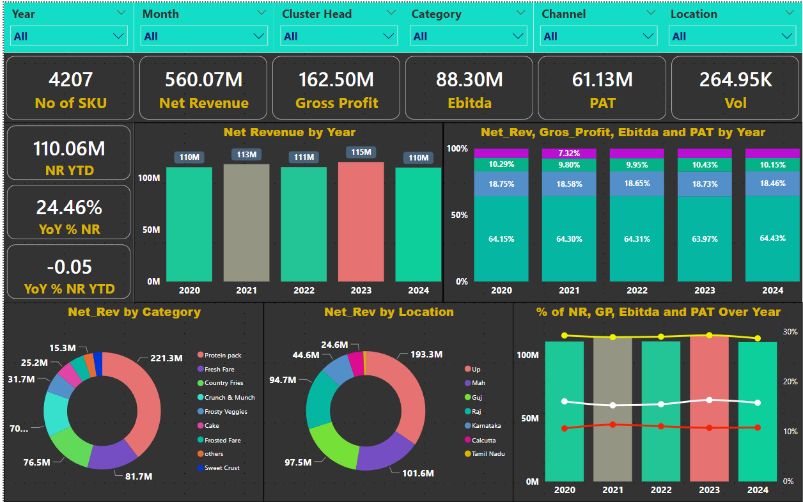
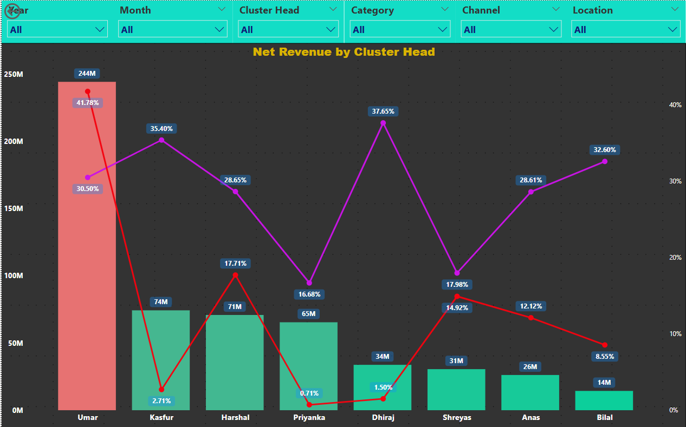
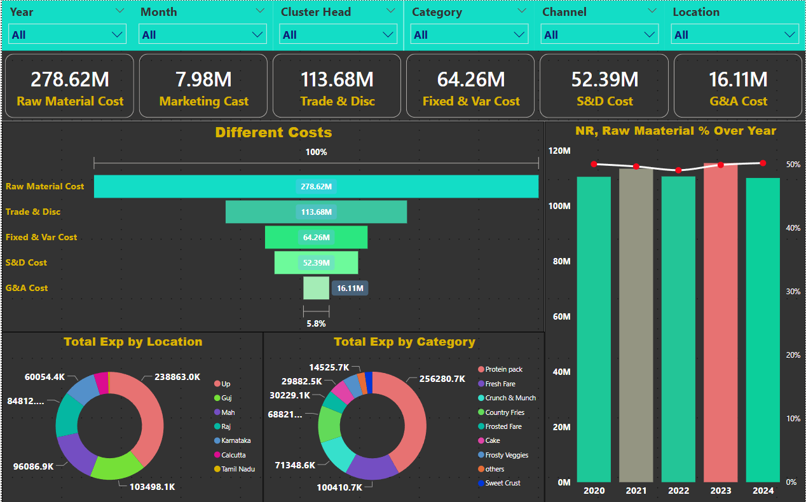
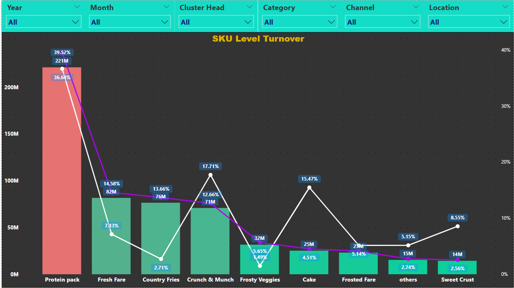

### Optimization of Business
    1.Top Category by Gross Profit & Net Revenue (Scatter Plot)
    2.Gross Profit & Volume Comparison with Average (Dynamic)
    3.Pareto Analysis
    4.Show highest sales by category and % of SKU Contribution (Mekko Chart)
# 📉 Dashboard
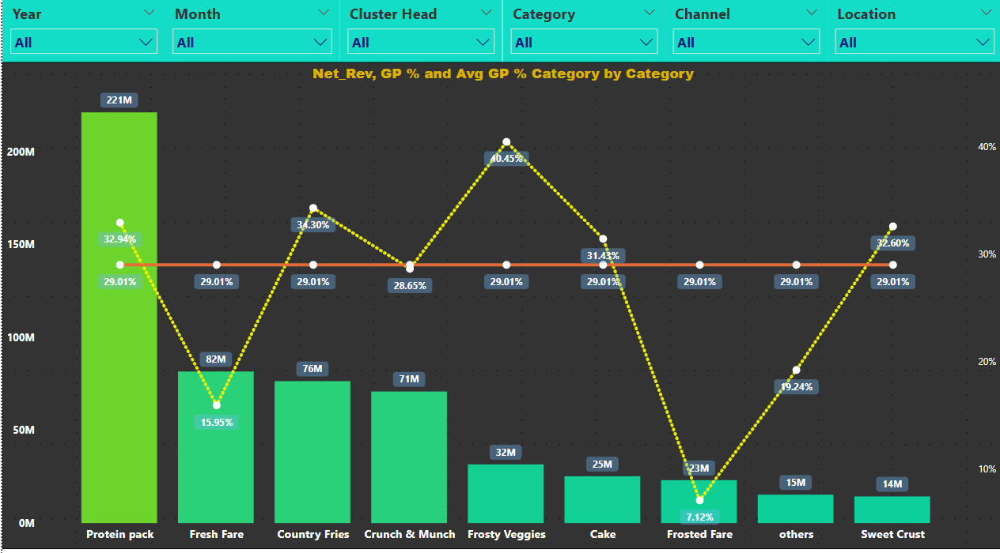
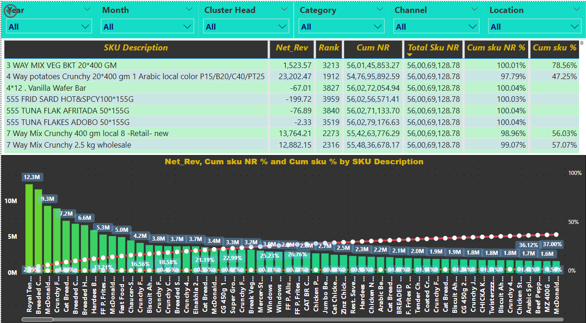
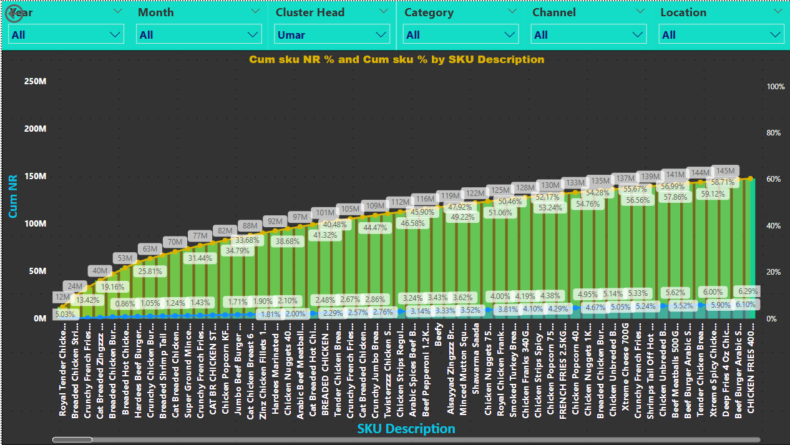
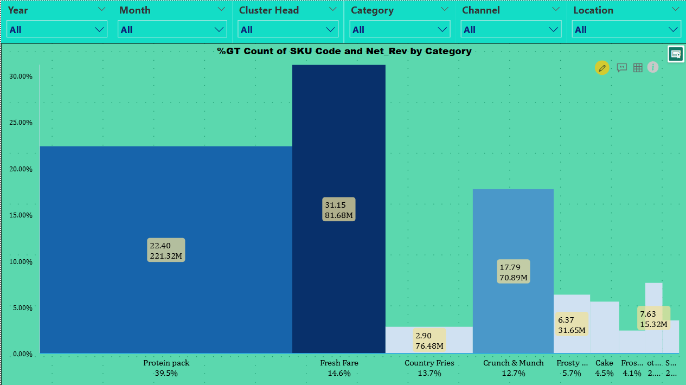

### Budgeting Analysis
    1.PVM Analysis
    2.Variance Analysi
    3.Actual Vs Budget Financial Analysis for Business Drivers ( Sales,EBITDA,PAT,Volume) with Trend YoY
    4.Actual Vs Budget Financial Analysis for Cost  Drivers ( COGS,Packging,Marketing) with Trend YoY
# 📉 Dashboard
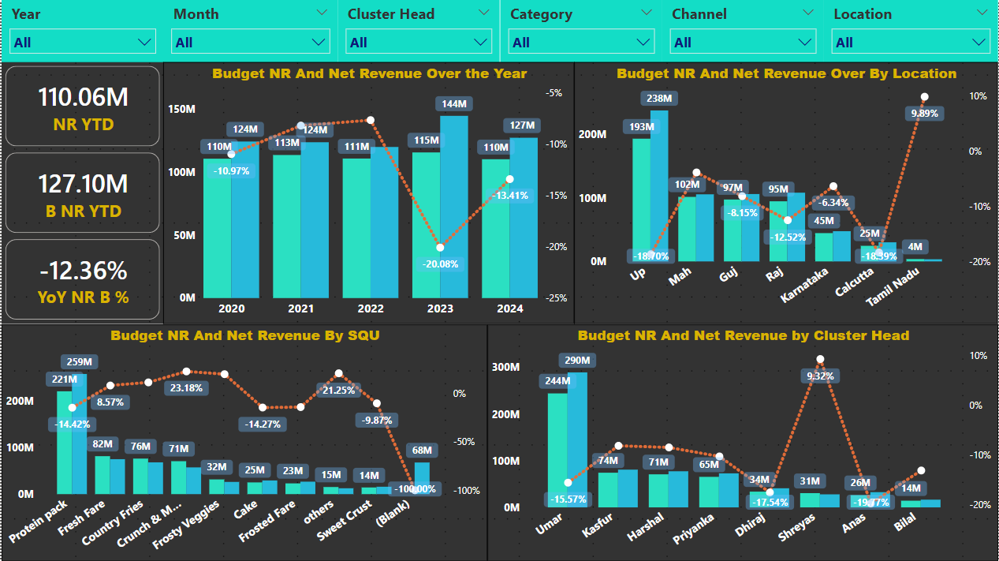
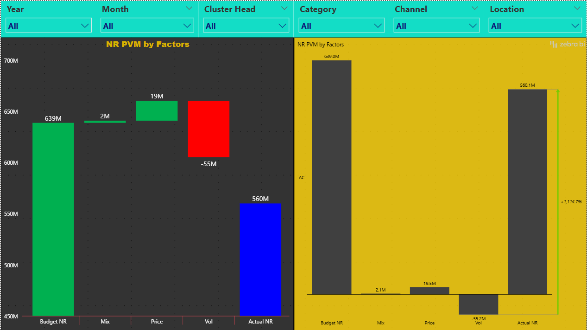
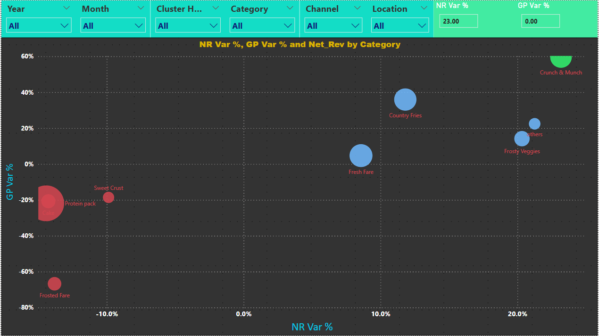

